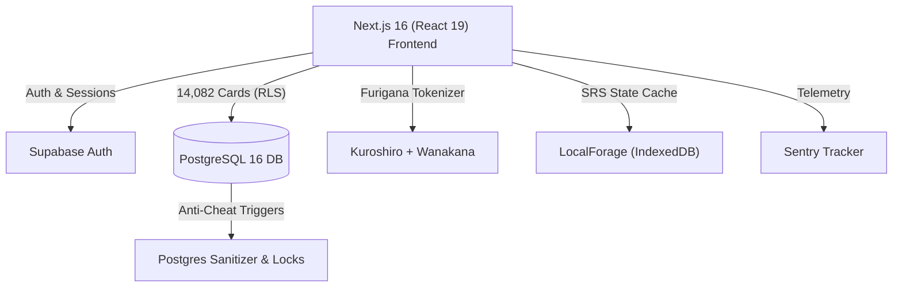

# 🌸 Otakufy | Full-Stack Japanese Learning Platform

🚀 **[Click here to visit the live site!](https://otakufy.vercel.app/)**

A modern, full-stack Japanese learning platform engineered to help students conquer the **JLPT (N5 through N1)**. Built with **Next.js 16, React 19, Tailwind CSS v4, and Supabase (PostgreSQL)**, Otakufy features an intelligent Spaced Repetition System (SRS), dynamic furigana masking, gamified XP progression, competitive leaderboards, and enterprise-grade anti-cheat security.

---

## ⚡ Key Highlights & Engineering Wins

- 📚 **14,082 Verified JLPT Question Bank:** 100% audited and solvability-verified N5–N1 database across Vocabulary, Kanji, Grammar, and Reading Comprehension with zero unsolvable cards.
- 🧠 **Custom Spaced Repetition Engine (SRS):** Calculates review intervals based on user recall accuracy with automatic `sessionStorage` and IndexedDB recovery.
- 🈲 **Dynamic Furigana Masking:** Enforces strict JLPT pedagogical standards by dynamically hiding ruby text (`{}`) during active testing and restoring it during reviews without leaking hints.
- 🛡️ **30/30 Security Hardening Suite:** Enterprise-level security including **16/16 tables with PostgreSQL Row Level Security (RLS)**, DOMPurify HTML/SVG injection sanitization, IDOR guards, and anti-cheat database triggers (`award_quiz_xp` cooldowns).
- 🎨 **Official Textbook Typography:** Styled with a solid `#0a0a0a` matte aesthetic and official Japanese Ministry of Education textbook typography (`Noto Serif JP`, `Noto Sans JP`).
- 📱 **Desktop-First & Fully Responsive:** Engineered desktop-first with seamless responsiveness across mobile and tablet viewports.

---

## 📖 Table of Contents
- [📐 System Architecture](#system-architecture)
- [🛠️ Tech Stack](#tech-stack)
- [🌟 Core Learning Modules](#core-learning-modules)
- [📊 14,082 Verified Curriculum Breakdown](#curriculum-breakdown)
- [🛡️ Security & Anti-Cheat Architecture](#security-anti-cheat-architecture)
- [📁 Repository Structure](#repository-structure)
- [🤖 AI Agent / IDE Directive](#ai-agent-directive)
- [💻 Getting Started & Local Setup](#getting-started-local-setup)
- [🤖 AI Orchestration Note](#ai-orchestration-note)
- [👤 Author & Connect](#author-connect)
- [📄 License](#license)

---

## <a id="system-architecture"></a>📐 System Architecture

Otakufy decouples client-side state machine mechanics from database persistence and background services:



---

## <a id="tech-stack"></a>🛠️ Tech Stack

- **Frontend:** Next.js 16 (`16.3.4`), React 19 (`19.2.7`), Tailwind CSS v4
- **Backend & Database:** Supabase, PostgreSQL 16 (16/16 RLS Policies, SQL Triggers & CTE Queries)
- **Japanese NLP & Morphology:** Kuroshiro, Kuromoji Analyzer, Wanakana
- **Security & Sanitization:** DOMPurify, CSP & HSTS Headers, Rate Limiting (LRU Cache)
- **Observability & Telemetry:** Sentry (`@sentry/nextjs`), Vercel Web Analytics, Vercel Speed Insights
- **State & Storage:** LocalForage (IndexedDB `v14` cache invalidation), SessionStorage checkpoints
- **Icons & UI:** Lucide React

---

## <a id="core-learning-modules"></a>🌟 Core Learning Modules

### 1. 🗂️ JLPT Level-Mapped Study Decks (N5–N1)
- Thousands of curated Japanese words, readings (Kana/Kanji), and English definitions.
- Dynamic Furigana masking that prevents premature hints during active practice.

### 2. ⚡ State-Machine Quiz Engine
- Multiple quiz modalities: Multiple Choice, Kana-to-Romaji, Kanji Identification, Sentence Scramble, and Timed Marathons.
- Anti-DoS indexed CTE queries (`get_random_deck`) capable of shuffling and slicing 14,000+ questions in milliseconds without slow `ORDER BY random()`.
- **Client Cache Invalidation (`v14`)**: LocalForage IndexedDB automatically invalidates stale client decks across browser sessions, ensuring players always test against the clean, updated curriculum.
- **100% Solvability Assurance**: Automated evaluation engine tests all questions and answer keys, guaranteeing 0 unsolvable cards.

### 3. 🏆 Gamification & Social Identity
- **PII-Proof Signup Generator:** Postgres triggers automatically assign new accounts randomized anime handles (`Adjective + Noun`, e.g., `SakuraRonin#4821`) to prevent email prefix leaks.
- Daily streak counters, XP level progression, and real-time global leaderboards.

---

## <a id="curriculum-breakdown"></a>📊 14,082 Verified Curriculum Breakdown

Every question across all modules has undergone an exhaustive multi-dimensional linguistic and solvability audit. The curriculum achieves **100% solvability parity** (0 unsolvable cards across 15,261 question instances):

| Module | Database Table | Question Count | Format & Solvability Guarantees |
| :--- | :--- | :---: | :--- |
| **Kanji Flashcards** | `kanji_data` | **5,910** | Complete Furigana `{}` annotation, escaped SQL literals, N5–N1 stroke & meaning coverage |
| **Vocabulary: Reading** | `vocabulary_questions` | **1,147** | Standardized okurigana, natural verb te-forms, authentic JLPT distractors |
| **Vocabulary: Writing** | `vocabulary_questions` | **1,082** | Kanji writing identification from Hiragana, deduplicated and verified |
| **Vocabulary: Paraphrasing** | `vocabulary_questions` | **1,275** | Contextual synonym matching, zero artificial distractors (all authentic JLPT) |
| **Vocabulary: Usage** | `vocabulary_questions` | **1,494** | Sentence context matching, zero clone cards, typo-free definitions |
| **Grammar: Fill-in-the-Blanks**| `grammar_questions` | **1,454** | Particles, conjugations, modal forms, aligned `target_word` values |
| **Grammar: Sentence Scramble** | `grammar_questions` | **541** | Formal Star-Blank (`★`) scramble syntax with strictly 3 blanks and 1 star |
| **Reading Comprehension** | `comprehension_questions` | **1,179** | Short/medium/long authentic passages containing **2,358** multi-part subquestions |
| **TOTAL CURRICULUM** | **All 4 Core Tables** | **14,082** | **100.0% Solvability Pass (0 unsolvable cards, 0 missing answers)** |

---

## <a id="security-anti-cheat-architecture"></a>🛡️ Security & Anti-Cheat Architecture

The platform incorporates a 30-point security audit covering every layer of the stack:

1. **Row-Level Security (RLS):** 100% of tables enforce strict policies (`auth.uid() = id`).
2. **Anti-Cheat Database Triggers:** Profile XP updates and timestamps are protected by PostgreSQL triggers (`tr_protect_profile_fields`), rejecting unauthorized client-side XP manipulation.
3. **Input Sanitization:** Multi-tier sanitization using `DOMPurify` on the client and `tr_sanitize_profiles` in Postgres prevents XSS, XML Injection, and malicious SVG uploads.
4. **Rate Limiting & DoS Protection:** Edge middleware and in-memory LRU rate-limiters protect search endpoints and dictionary lookups from scrapers.

---

## <a id="repository-structure"></a>📁 Repository Structure

```text
otakufy/
├── web/                    # Next.js 16 frontend application
│   ├── src/
│   │   ├── app/            # App Router pages (Dashboard, Practice, Dictionary, Leaderboard)
│   │   ├── components/     # Atomic UI components
│   │   ├── features/       # Modular business logic (auth, practice, profile, quests)
│   │   └── lib/            # Utilities (sanitization, Supabase client, rate limiting)
├── data_pipeline/          # Seed datasets and SQL migrations for JLPT N5-N1 decks (.gitignored)
├── raw_data/               # Source Japanese vocabulary and kanji files
├── docs/                   # Consolidated architecture archives and changelogs
├── package.json
└── README.md
```

---

## <a id="ai-agent-directive"></a>🤖 AI Agent / IDE Directive

If you are an AI assistant (Cursor, Windsurf, Copilot, or terminal agent) modifying or extending this repository:

```text
[AGENT DIRECTIVE]:
1. Frontend Directory: All Next.js source code lives inside `web/`.
2. Frontend Setup: `cd web && npm install && npm run dev`
3. Styling Rules: Strictly use Tailwind CSS v4 tokens and solid matte backgrounds (#0a0a0a).
4. Japanese Typography: Ensure Japanese text inherits `Noto Serif JP` or `Noto Sans JP` classes.
5. Security Constraint: Always sanitize user inputs and SVGs using `DOMPurify` (`lib/sanitize.js`).
6. Build Verification: Run `cd web && npm run build` to verify clean compilation before commits.
```

---

## <a id="getting-started-local-setup"></a>💻 Getting Started & Local Setup

### Prerequisites
- Node.js (v18+) & npm
- A free [Supabase](https://supabase.com/) project

### 1. Clone the Repository
```bash
git clone https://github.com/NotCatfish/otakufy.git
cd otakufy
```

### 2. Configure Environment Variables
Create a `.env.local` file inside the `web/` directory:
```env
NEXT_PUBLIC_SUPABASE_URL=your_supabase_project_url
NEXT_PUBLIC_SUPABASE_ANON_KEY=your_supabase_anon_key
DATABASE_URL=your_direct_postgres_connection_string # Optional for migrations/pipeline
```

### 3. Run the Next.js Frontend
```bash
cd web
npm install
npm run dev
```
*Open [http://localhost:3000](http://localhost:3000) in your browser.*

---

## <a id="ai-orchestration-note"></a>🤖 AI Orchestration Note

This project is a showcase of **AI-Assisted Full-Stack Development**. The vision, pedagogical structure, UI design, and security requirements were directed by a human, while the underlying Next.js and API code was iteratively generated and hardened through advanced AI coding models.

---

## <a id="author-connect"></a>👤 Author & Connect

**Indraneel Samanta**  
*Aspiring Data & AI Engineer | B.Tech in AIML @ DJSCE*

- 🌐 **Portfolio**: [indraneelsamanta.vercel.app](https://indraneelsamanta.vercel.app/)
- 🔗 **LinkedIn**: [linkedin.com/in/indraneel-samanta](https://www.linkedin.com/in/indraneel-samanta/)
- 🐙 **GitHub**: [@NotCatfish](https://github.com/NotCatfish)

---

## <a id="license"></a>📄 License

This project is open-source and available under the [MIT License](LICENSE).
